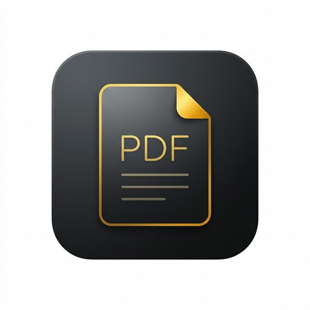
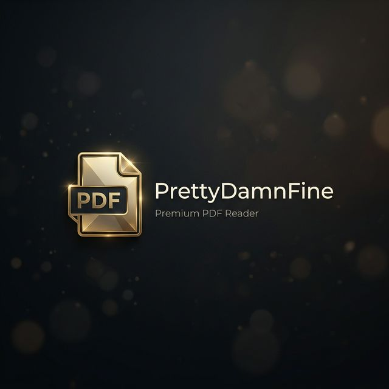
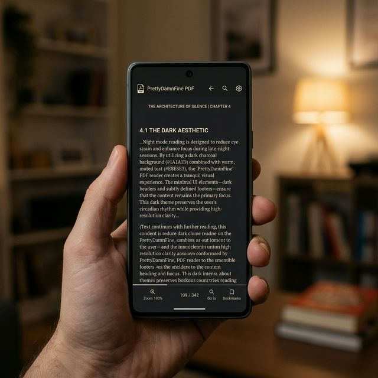
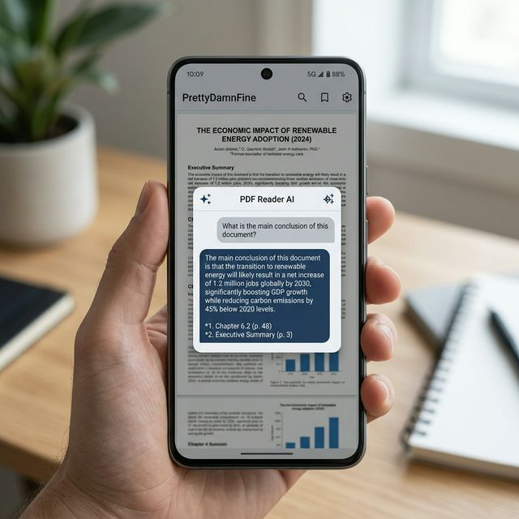

<div align="center">



# PrettyDamnFine
**A Premium, Minimalist Android PDF Reader powered by AI**

[](https://opensource.org/licenses/Apache-2.0)
[](https://f-droid.org/)

<br/>


</div>

---

## ✦ Overview

**PrettyDamnFine** is a distraction-free, privacy-conscious PDF reader designed for deep work. It strips away the clutter of traditional document viewers, offering a gesture-driven interface that puts your content front and center. 

When you need to extract key insights, jump to conclusions, or summarize complex chapters, the integrated **AI Semantic Search** acts as your personal reading assistant.

## ✨ Core Features

- 🌑 **Cinematic Reading Themes**: True light mode, a warm sepia envelope, and a comfortable, contrast-balanced dark mode designed to reduce eye strain during late-night reading sessions.
- ⚡ **High-Performance Rendering**: Built on robust native rendering APIs, ensuring smooth scrolling and instantaneous zooming—even for massive, graphics-heavy files.
- 🧠 **AI-Powered Semantic Search**: Speak to your documents. Ask questions in natural language and receive concise, intelligent answers based strictly on the document text. *(Requires a user-provided Groq API key)*.
- 🧭 **Gesture-Driven UX**: Hide the UI at will. Double-tap to zoom, pinch to pan, and rely on subtle cues rather than intrusive toolbars.
- 📚 **Smart Library**: Automatically curates your workspace, tracking recent documents and bookmarking your exact page and zoom level for a seamless return.

---

## 📸 Interface Preview

<div align="center">
  
  
  
</div>

---

## 🛠️ Installation & Building

### Standard Download
You can download the latest compiled `.apk` directly from the [Releases page](../../releases).

### F-Droid
*F-Droid submission is currently underway. Once approved, the app will be available in the main repository.*

### Build from Source
To build PrettyDamnFine yourself, you'll need Android Studio (or a standard Android Gradle toolchain).

```bash
# Clone the repository
git clone https://github.com/Blprk/PrettyDamnFine.git

# Navigate into the project
cd PrettyDamnFine

# Build the release APK
./gradlew assembleRelease
```

---

## 🔒 Privacy & AI Configuration

PrettyDamnFine is fully offline-first. Your PDFs never leave your device unless you choose to use the AI Semantic Search feature.

To use AI features:
1. Obtain a free API key from [Groq](https://console.groq.com/keys).
2. Open the app settings (⚙️) from the Library view.
3. Enter your key securely.

*Keys are stored encrypted locally on your device via `EncryptedSharedPreferences`.*

---

## 📄 License & Legal

This project is licensed under the **Apache License 2.0**. See the [LICENSE](LICENSE) file for more information. 

AI capabilities rely on third-party integrations (Groq Inc.). Users are responsible for adhering to corresponding terms of service when passing text into the API.
